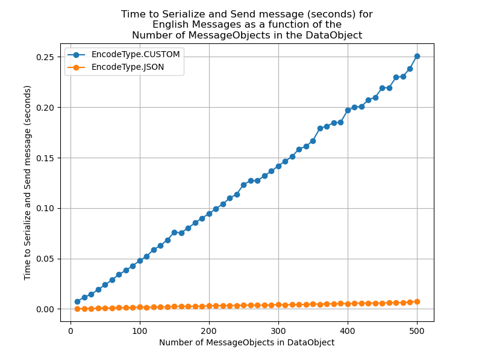
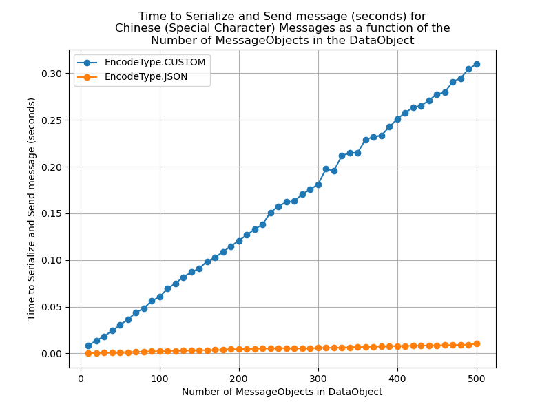
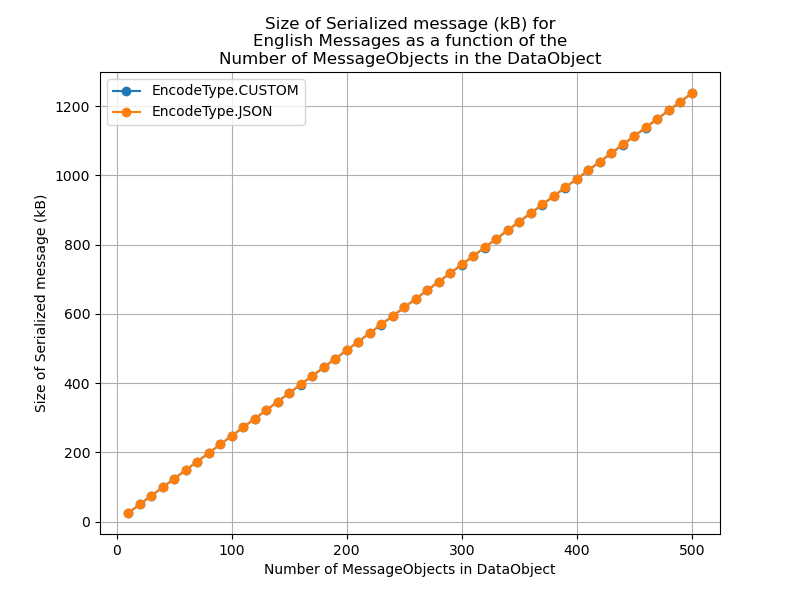
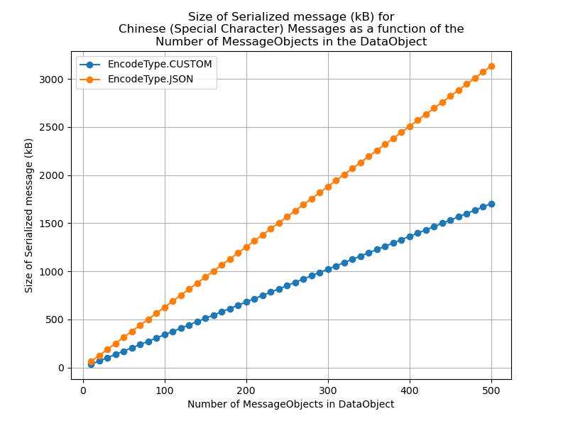
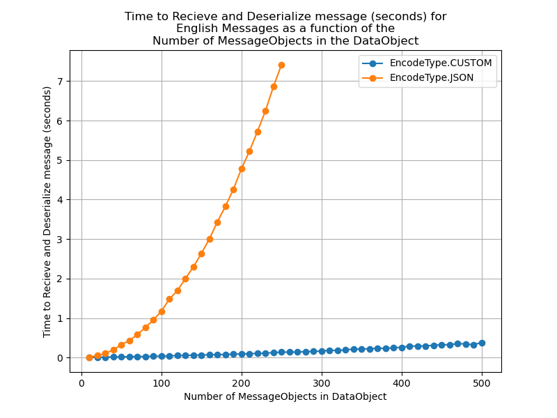
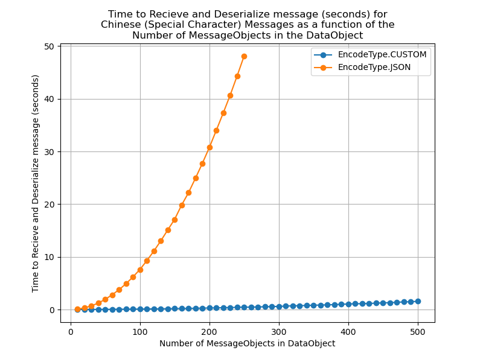

# Wire Protocols: Documentation
Charlie Chen and Eric Gong

## Contents
- **Usage**
- **Folder and File Layout**
- **High-level Server Organization**
- **High-level Client Organization**
- **DataObjects and Custom Serialization**
- **Testing**

## Usage
All commands should be executed in the Code directory.

### Normal Operation
  Start up the server by running "python ServerDaemon.py HOSTNAME CLIENTPORT DATABASEPORT"

  Startup the client by running "python Client.py HOSTNAME CLIENTPORT"

### Testing and Debugging
  Run the Unit tests by running "pytest"

  Startup the terminal client (for debugging) by running "python TerminalClient.py HOSTNAME CLIENTPORT"

### Analytics for Custom and JSON Wire Protocols
  Collect data by running "python Analytics.py Generate HOSTNAME PORTNAME"

  Analyze data by running "python Analytics.py Analysis"

  Print the size of the base English and Chinese messages by running "python Analytics.py Size"

## Folder and File Layout
Directoy names are bolded, file names are italicized. Some less relevant directories and files are ommitted; the ommission is noted in the bullet of the parent directory.
- **Code**: Contains all currently used code
    - **Modules**: Contains Classes and Constants used in *ServerDaemon.py*, *Client.py* and similar python scripts
        - *DataObjects.py*: A DataObject Class for all inter-process communication and MessageObject Class for messages specifically 
        - *DatabaseManager.py*: A DatabaseManager Class that handles all database related actions (querying, inserting, deleting, etc.)
        - *Constants.py*: A configuration file containing the constants that are used by the DataObjects and DatabaseManager classes
        - *Flags.py*: A definition of the possible Requests and Statuses for the DataObject Class
        - *SelectorData.py*: A SelectorData Class used by the selectors in ServerDaemon.py
    - **User_Data**: Contains the Password.db and Message.db databases (.db files are ommitted)
    - **Tests**: Contains tests for the Database and DataObjects (DataObject and MessageObject) (test files are ommitted)
    - **Analytics**: Contains plots, test data, and results used in, or generated by *Analytics.py* (test data and results files ommitted)
        - **Plots**: Contains the plots generated by *Analytics.py*
    - *Client.py*: Code to run the client-side of the project
    - *ServerDaemon.py*: Code to run the server-side of the project
    - *TerminalClient.py*: Simple terminal-based client end, useful for debugging
    - *Analytics.py*: Used to quantify the difference between Custom and Json Wire Protocols
- **Documentation**: Contains the Engineering Notebook, notes on Code Review Groups, and this documentation document
    - *Documentation.md*
    - *engineering_notebook.md*
    - *Group_notes.md*
- **Old_Versions**: Used as a repository for older versions of the client and server code (subdirectories and files ommitted)
- **venv**: Virtual Python Environment (subdirectories and files ommitted)

## High-level Server Organization
Our server involves three main components: a single Daemon process, a single Database process, Login/Register processes, and User processes. 

On the Server side:
Upon starting up, the Daemon process first creates a Database process, to handle all databse queries from Login processes and User processes. The Daemon process handles incoming Client connections, spawning (not forking) a new Login process for each connection. Should the Client succeed in the login, the Login process spawns a new User process to handle normal operations.

On the Client side:
The Client code is a script which runs a single Client process that initiates one connection with the Daemon process. The Client process is oblivious and agnostic (in terms of functionality) to the transition between various processes (Daemon, Login, User) on the Server side.

We choose this framework for three main reasons: Scalability, Simplicity, and Security.

### Scalability
As opposed to having a single process handle incomming connections, Client requests, and Database queries, we choose to spawn multiple processes to handle these tasks. This supports scalability as it allows for the batching of tasks. For instance, imagine the process of querying messages: if a Client requests 10 messages, the User process (on the Server side) could request 100 from the database (or even, the User process could pre-laod 100 messages upon Client login), and provide 10 to the Client. Should the Client request 10 more messages or 20 more, no additional database queries are needed. In addition, simple tasks, such as ensuring the validity of requests can be conducted in a User process running concurrently to other user processes. If all Server-side tasks were handled one-at-a time by a single process, the Server would suffer if more clients attempted to connect. While it is true that no server can support arbitrarily large number of processes, additional cores and additional memory to host more processes is far more cost-effective than attempting to hyper-optimize single-threaded code to support more users.

Furthermore, note that by having the database process as a separate process that communicates with the User processes through sockets, this ensures that the database process and database files need not be on the same server as the Daemon or User processes. (We would simply start up the Database process with a separate script, as opposed to having it be started by the Daemon process, which we currently do for simplicity). This is particularly useful in distributed systems, where spatial locality guarantees are weak, if not non-existent. 

### Simplicity
One may wonder about the choice to have exactly a single Database process. Indeed, our server has only one process handle all database queries. We do this for simplicity: with a single Database process, we need not worry about implementing locks to prevent race conditions and concurrent writes. We note however, that a single Database process is sufficient for the purposes of a messaging platform: the majority of the user's time will be spent reading messages, drafting messages, and being idle; as such for any given user, the queries generated to the database will be in bursts and fairly infrequent. In combination with techniques such as batching - made possible by dedicated user processes - it is viable to have a single dedicated Database process.

### Security
There are a plethora of security benefits to having dedicated processes. To name a few:
- It is possible to restrict the permissions of a User process (ie: file system restrictions via *chroot*), such that even if Client is malicious and intelligent, capable of subverting a server-side process, the damages can be mitigated. Having the ability to directly communicate with the server increases the risk of subverting a process with high enough priviledge and file access permission to do damage
- It is possible to mitigate the damage of potential implementation bugs. Imagine that an error in the de-serialization process caused the process to crash. In a single process server, the entire server would come to a halt. In the case of a multi-process system, only a single User Process would crash, limiting the impact of damages.
- It is possible to efficiently implement complex authentication and encryption techniques with minimal negative impacts on scalability. The Diffie-Hellman Protocol, a standard method for negotiating a symmetric key for secure communications, requires a non-trivial amount of time. Should it be conducted with a single server process that directly handles all clients, the negative impacts on scalability would be noticable, and more complex cryptographic techniques would only result in more negative impacts.

### Notes and Considerations
- On the matter of the benefits of this framework, while it is true that we have not had the time to implement many of the mentioned strategies for fully levveraging a multi-process server, by creating this foundation, we make such strategies possible, which ultimately ensures scalability over systems for which these strategies cannot be implemented, due to an insufficient foundation.
- On the matter of creating new processes, we use the *multiprocessing* library to handle the creation (via spawning) of the Database process, Login processes, and User processes. Due to cross-system compatibility with POSIX systems, we cannot use os.fork from the *os* library, nor can we use the fork method provided by *multiprocessing*. However, spawning is also convenient as it creates a completely new python environment, maintaining no state from the parent. This makes it easier to safely use global variables that would otherwise be a potential source for race conditions.
- On the matter of batching requests, we note that it would be unwise to attempt to batch on the client end. In the case of getting messages, for example, there are no gurantees on the network speed or memory capacity of the user's device. It would be unwise to send 100 messages at once to the client, and far better instead, to store them on a dedicated Client process.
- On the matter of a singular Database Process, we note that crude (low granularity) locking mechanisms that are not well engineered provide no gurantees of performance over having a single database process, given that crude locking mechanisms essentially limit the writing of the files to one-process-at-a-time. Yet the finer grain the scheme, the more locks that are implemented, the more likely implementations may be imperfect and contain bugs.

## High-level Client Organization and Communication Flow
Our client switches between three main processes: the initial Login page, a user Registration page, and the main User client.

### Initial Connection
Upon opening the app, the client tries to establish a connection with the server. Apart from a few exceptions (see user client initialization and incoming messages), communications are initiated by the client with a pending request, and the client awaits a confirmation response from the server. 

### Client Initialization
After registering for an account/logging in (and sending info/receiving server confirmation), the user client process opens, and initializes with an incoming message from the server a) confirming that the current user is not already logged in on another device, and b) sending the user's current number of unread/total messages. This is one of two communications that the client does not initiate.

### Typical Communications
For all other communications (aside from incoming messages), the client initiates communication with a request to the server containing the request code and any needed data. Instead of blocking to await server confirmation, we utilize Tkinter's built-in `createfilehandler` function, which binds a custom function to any incoming activity on the server socket. The client maintains a dictionary of pending requests with unique request id's as keys and request types as values. (We generated the request ID with microsecond granularity so that it is ordered and, for most intents and purposes, unique even across consecutive for loop iterations.) After any server request, the client checks every 100ms for a response to a pending request; if successful, it removes the pending request from the dictionary. Subsequent needed actions are carried out in the event handler.

### Incoming Messages
This socket event handler mitigates the need to constantly check for incoming messages and possibly run into race conditions based on which sections of code happens to handle the response. When the client receives an incoming message on the socket from the server, it immediately handles the request and updates the necessary frontend components to display the message in real time to the user (re-query messages from the server, update number of read/unread messages, etc).

### Logout and Account Deletion
When the user logs out or deletes their account, the client sends a server request to update the database, and upon confirmation, closes its connection with the server and reconnects using the command-line arguments.

## DataObjects and Custom Serialization
We create a universal DataObject to standardize the interface by which the Client and Server communicate, as well as the interface by which the various server-side processes inter-communicate. We also create a MessageObject to store the contents of a single message. Multiple MessageObjects can be placed within a single DataObject. To avoid the redundancy of creating two copies of the same code for the two wire protocol implementations (Custom and JSON), we specify a global constant in Constants.py which dicates whether the wire protocol shall use the JSON or Custom implementation. The DataObject and MessageObject classes contain code that will switch protocols based on this global constant.

### DataObject
We support the following fields in the DataObject:
- Request (Of type Request) to specify the specific request that is being issued or responded to
- Status (Of type Status) to specify the status of the returned request (Initially Status.PENDING when issued)
- Sequence (Of type int) to specify a unique identifier for each DataObject (inspired by IP Sequence numbers)
- User (Of type str) to specify the Client username issuing the request (blank before login confirmed)
- Datalen (Of type int) to specify the number of elements in Data (as a sanity check of data validity)
- Data (Of type list[str]) to specify the data being passed within the DataObject (such as a serialized MessageObject)

### MessageObject
We support the following fields in the MessageObject:
- Id (Of type int) to specify a unique identifier for each message (generated by the database, 0 before assignment)
- Sender (Of type str) to specify the sender
- Recipient (Of type str) to specify the recipient
- Time_sent (Of type str) to specify the time the message was sent
- Read (Of type bool) to specify whether the message has been read (delivered)
- Subject (Of type str) to specify the subject
- Body (Of type str) to specify the body of the messsage

### Custom Serialization:
For the Custom serialization, we hoped to design a serialization method that is highly efficient, containing minimal overhead, and thus being close to the same size as the data to be sent. To do this, we choose to separate each of the fields via "\n". To ensure that the fields themselves do not contain "\n", we define an encoder that maps "\n" to "%0". To ensure that the fields themselves do not contain "%0" naturally, we map all "%" to "%0". Thus, this creates a bijective mapping between any arbitrary field (which may need to be re-represented as a string, such as the case of the Request or Status flags) and a version of the field guaranteed not to contain "\n".

After separating fields with "\n", we wish to further ensure that we can ensure the start and end of messages can be easily identified. This is necessary if multiple messages are read out of the socket in a single instance, or if a long message breaks across muliple reads out of the socket. To do this, we serialize the concatenation of the fields, and wrap the concatenation with "\n". If one of the fields is a list, as is the case with DataObject.data, we can encode the list first, using the same method. Note that our encode and decode functions work directly upon the byte string (which is derived via str.encode("utf-8"))

A quick toy example:
1. We want to encode: b"Hello\nTo\nYou", b"Goodbye", \[b"Message\nHere", b"100%\nIs Larger Than\n90%"\]
2. We encode the items of the list: b"Message%1Here", b"100%0%1Is Larger Than%190%0"
3. We concatentate the list with "\n" into a single byte string: b"Message%1Here\n100%0%1Is Larger Than%190%0"
4. We encode each field: b"Hello%1To%1You", b"Goodbye", b"Message%01Here%1100%00%1Is Larger Than%0190%00"
5. We concatenate the fields with "\n": b"Hello%1To%1You\nGoodbye\nMessage%01Here%1100%00%1Is Larger Than%0190%00"
6. We encode again, and wrap in "\n": b"\nHello%01To%01You%1Goodbye%1Message%001Here%01100%000%1Is Larger Than%00190%000\n"
7. We reverse these steps to extract the original messages

### JSON and Custom Wire Protocol Benchmarking
To determine a holistic comparison between the JSON and Custom wire protocol implementations, we examine three key metrics: the time to serialize and send data as a function of data size, the time to recieve and deserialize data as a function of data size, and the actual size of the serialization as a function of data size. We examine both English text and Chinese text as base messages, so as to characterize the impact that special characters (such as chinese characters, emoji symbols, or similar unicode characters) have. Specifically, we have constant English and Chinese messages, which are placed as both the subject and body within a MessageObject, and data size is varied based on the number of instantiations of MessageObjects placed within a single DataObject.

A single English message is 1154 bytes and a signle Chinese message is 1352 bytes. So, a Message Object, with 15 bytes for the Sender and Recipient name, and the message as both the subject and body is roughly 2.27 kB and 2.66 kB for the English and Chinese messages respectively. 

#### Time to Serialize and Send as a function of Message Size (MessageObject count):

  
  

Based on the graphs, it can be observed that the serialization time for both the Custom and JSON implementations increase linearly with the number of MessageObjects. However, the Custom implementation is slower; refering to the raw numerical data in results.txt, we determine that the Custom implementation is roughly 30 to 33 times slower at serialization than is the JSON implementation for the same messages, in both the English and Chinese messages. The JSON implementation has a serialization rate of 148 MB and 129 MB per second for English and Chinese messages respectively, and the Custom implementation has a serialization rate of 4.41 MB and 4.18 MB per second for both English and Chinese messages.

#### Size of Serialized Message as a function of Message Size (MessageObject count):

  
  

Based on the graphs, it can be observed that the serialized message size as function of the Message size for English messages is roughly the same for both the Custom and JSON implementations. In both cases, there is a roughly 9% increase in the size of the final serialized message in comparison to the total data that is being serialized. In the case of Chinese messages however, the serialized data size for the JSON implementation is roughly 80% larger than the serialized data size for the Custom implementation. The Custom implementation is roughly a 28% increase when compared to the size of the total data that is being serialized, and the JSON implementaiton is roughly a 136% increase when compared to the size of the total data that is being serialized. This large difference may be due to the differences in character to byte encoding style: our custom implementation uses the UTF-8 encoding for special characters, whereas JSON uses Unicode-Escape.

#### Time to Recieve and De-Serialize as a function of Message Size (MessageObject count):

  
  

We hoped to characterize both how long it takes for a target to recieve the sent data. This is a combination of passing data through the network, as well as de-serializing. Thus, this metric is a combination of the two. As seen in the graphs, we find that while the Recieve time for our Custom implementation grows roughly linear with respects to message size, the Recieve time for the JSON implementation surprisingly grows exponentially with the increasing message size. In particular, it appears that attempting to recieve a DataObject with 250 MessageObjects containing Chinese messages (roughly 58 kB of Chinese Characters, pre-serialization) requires nearly 50 seconds. We eliminated the possibility of (HUIT-imposed) network throttling by re-attempting the experiment on a different day, yet the results remain roughly the same. As such, we surmise that the JSON.loads method may be imposing semantic checks that greatly increase the amount of time that is necessary to de-serialize the message.

#### Comparison:
If comparing between a naive JSON wire protocol and our Custom wire protocol, the net throughput of our Custom protocol is significantly better, particularly due to the bottleneck in deserialization faced by the JSON protocol. Our protocol also utilizes a more efficient encoding of special characters, whcih improves throughput, particularly when the network becomes the bottleneck. A custom JSON deserializer may reduce the deserialization bottleneck, in which case the JSON wire protocol may be more favorable, due to the significantly higher serialization throughput. However, we can employ more efficient strategies for Custom serialization to reduce the throughput difference between the Custom and JSON serialization methods (se the Notes section for one potential approach).

In terms of scalability, both implementations can be easily adapted should there be changes to the DataObject and MessageObject class. The main question lies in the scalability of the service. As it is right now, the Custom implementation is more conducive to scalability, given that the net throughput is higher, meaning more clients can share more data. While JSON is a universal protocol, there is no need for a universal protocol when the data being stored is not meant to be shared broadly: the data is only meant to be shared between server processes and client, which are all in agreement on the protocol semantics. One exception to this is the modification of the protocol between difference versions. However, there are various work-arounds, such as informing the client they must update their Client-side code, or simply having multiple methods to deal with the each of the various versions.

### Notes and Considerations:
- On the matter of the Custom serialization bottlneck, each encoding and decoding is a linear scan through the utf-8 byte encoding of each Field or Data item. We currently scan multiple times, as seen in the toy example, but this could be changed to a more advanced single scan. For instance, when encode is applied twice "\n" in fields would directly map to "%01", "%" in fields would map to "%00". Similiarily "\n" in the data list elements maps to "%001" and "%" in data list elements maps to "%000". Indeed, given that both the JSON and Custom serialization implementations are seen to scale linearly in Send Time with respects to message size, reducing the number of linear passes will make the Custom implementation more comperable to the JSON serialization method.

## Testing
### Unit Testing
We use the pytest framework to execute code and assert the validity of the results. Specifically, we test the validity of the DatabaseManager Class in *test_DatabaseManager.py* and test the validity of the DataObject and MessageObject Classes in *test_DataObjects.py*. In total, we test the validity of 218 Assertions for the DataObject and MessageObject Classes (between the Custom and JSON implementations), including the Custom Encoding/Decoding process, normal operation with edge cases, and expected instances for Exceptions to be throw (ie: attempting to deserialize an invalid serial). In total, we test the validity of 108 Assertions for the DatabaseManager, encompassing the various functionalities the DatabaseManager provides, testing tasks that ought to suceed, testing when tasks ought to return with a flag indicating the action cannot be carried out (such as attempting to add an already existing user), and testing the internal state of  the database after a specific series of actions.

### Integration Testing and Roleplaying-based Testing
We test the Client interface simply by interacting with it, and examining the logs printed by the client process, as well as the various processes in the Server-side to ensure that expected actions are carried out correctly. In addition, we built a terminal-based version of the client, more suitable for fast testing of the Server-side logic. We execute integration testing of the server through the terminal-based client, ensuring that the Login process logic is correct for Client logins, and that the User Process properly routes Requests to the database process, and that the proper response is returned. Note that by Unit testing the database process, we need not expend additional effort during integration testing to confirm the validitly of database operations; we need only confirm that logic outside of the DatabaseManger Class, within the Login process, User process, and Database process are valid.